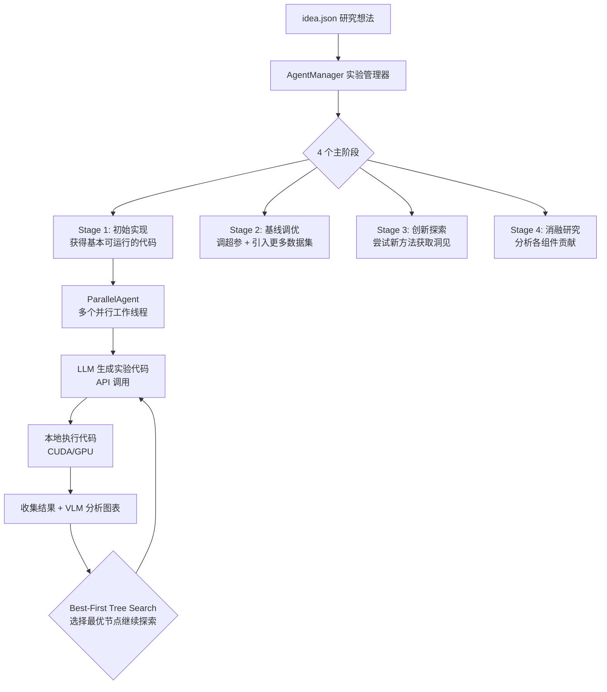

<div align="center">
  <h1>
    <b>AI Scientist-v2 中文指南</b><br>
    <b>基于智能体树搜索的 Workshop 级自动化科学发现</b>
  </h1>
</div>

## 项目概述

AI Scientist-v2 是一个**全自主的科研系统**，能够独立完成从**构思 → 实验 → 分析 → 写论文 → 审稿**的整个科研流程。
自用于实现部分 idea 的实验

### 核心思想

```
"LLM 当大脑，GPU 当手脚"
```

- **LLM（通过 API 调用）**: 负责思考——构思想法、编写实验代码、分析结果、撰写论文
- **本地 GPU（需要 CUDA）**: 负责执行——运行 LLM 生成的 ML 实验代码（训练模型、跑推理等）

> **这就是为什么既需要 API Key 又需要 GPU**：API 用来调用 LLM 大脑，GPU 用来执行 LLM 大脑设计的实验代码。

---

## 系统架构

```
ai_scientist/
├── ideas                           # Idea 文档撰写处
├── llm.py                          # LLM 统一调用层（支持 OpenAI/Claude/Gemini/DeepSeek/Ollama 等）
├── perform_ideation_temp_free.py   # 【入口1】想法生成脚本
├── treesearch/                     # 核心：树搜索实验引擎
│   ├── agent_manager.py            #   实验管理器（4阶段流水线）
│   ├── parallel_agent.py           #   并行实验智能体（代码生成 + 执行 + 反馈）
│   ├── perform_experiments_bfts_with_agentmanager.py  # 树搜索主入口
│   ├── journal.py                  #   实验日志（树节点管理）
│   ├── interpreter.py              #   代码执行器（本地运行 LLM 生成的代码）
│   ├── log_summarization.py        #   日志摘要
│   └── backend/                    #   LLM 后端工具
├── perform_writeup.py              # 论文撰写（8页 ICML 格式）
├── perform_icbinb_writeup.py       # 论文撰写（4页 ICBINB 格式）
├── perform_plotting.py             # 图表聚合
├── perform_llm_review.py           # LLM 文字审稿
├── perform_vlm_review.py           # VLM 图片/引用审稿
├── tools/
│   └── semantic_scholar.py         # Semantic Scholar 文献搜索工具
├── ideas/                          # 示例 idea 文件
└── utils/
    └── token_tracker.py            # Token 用量追踪

launch_scientist_bfts.py            # 【入口2】主流水线启动脚本
run_experiment.py                   # 【入口3】实验启动脚本
run_post_experiment.py              # 【入口4】论文撰写启动脚本
bfts_config.yaml                    # 树搜索 + 实验配置文件
```

---

## 完整流程

整个系统分为 **两个独立的入口** 和 **五个阶段**：

### 入口 1：想法生成（Ideation）

```
python ai_scientist/perform_ideation_temp_free.py \
  --workshop-file "ai_scientist/ideas/my_topic.md" \
  --model gpt-4o-2024-05-13 \
  --max-num-generations 20 \
  --num-reflections 5
```

**做什么**：LLM 阅读你的研究主题描述 → 搜索 Semantic Scholar 文献 → 生成多个研究想法 → 每个想法经过多轮反思优化 → 输出结构化 JSON 文件

**输入**：`.md` 格式的研究主题描述文件（包含 Title、Keywords、TL;DR、Abstract）

**输出**：`.json` 格式的想法列表（每个想法包含 Name、Title、Hypothesis、Experiments 等字段）

**资源消耗**：仅调用 LLM API，不需要 GPU，费用约几美元

---

### 入口 2：主流水线（Paper Generation）

```
python launch_scientist_bfts.py \
  --load_ideas "ai_scientist/ideas/my_topic.json" \
  --load_code \
  --model_writeup o1-preview-2024-09-12 \
  --model_citation gpt-4o-2024-11-20 \
  --model_review gpt-4o-2024-11-20 \
  --model_agg_plots o3-mini-2025-01-31 \
  --num_cite_rounds 20
```

这个入口是 **真正的核心**，串联了以下四个阶段：

---

### 阶段 1️⃣ 树搜索实验（核心阶段，需要 GPU）



### 增加入口 3：实验优化线（Experiment Implement and Optimization）

```
python run_experiment.py \
  --load_ideas "ai_scientist/ideas/new_idea_test.json" \
  --idea_idx 1

# 带已有 baseline 代码迭代
python run_experiment.py \
  --load_ideas "ai_scientist/ideas/new_idea_test.json" \
  --idea_idx 1 \
  --code_file "experiments/上一次的/logs/0-run/best_solution_X.py"
```

### 增加入口 4：数据图绘制与论文撰写（Figure Plots and Paper Writing）

```
python run_post_experiment.py \
  --experiment_dir "experiments/2026-04-04_15-26-17_conflict_memory_allocation_attempt_0" \
  --model gpt-5.4 \
  --writeup-type icbinb

python run_post_experiment.py \
  --experiment_dir "experiments/2026-04-05_11-32-59_conflict_memory_allocation_attempt_0" \
  --model gpt-5.4 \
  --model_plots gpt-5.4-mini \
  --writeup-type icbinb
  --skip-plots
```


**关键概念**：

| 概念 | 说明 |
|------|------|
| **Best-First Tree Search (BFTS)** | 每次实验尝试是树上的一个节点，系统优先扩展最优节点，类似 A* 搜索 |
| **AgentManager** | 管理 4 个主阶段的流转，每个主阶段可包含多个子阶段 |
| **ParallelAgent** | 负责实际的代码生成和执行，支持 `num_workers` 个并行探索路径 |
| **Journal** | 记录所有实验节点的日志，跟踪 metric、代码、bug 状态 |
| **Stage 流转** | 每个阶段有完成条件（如 Stage 1 找到可运行代码就进入 Stage 2），由 LLM 评估 |

**4 个主阶段详细说明**：

| 阶段 | 名称 | 目标 | 完成条件 |
|------|------|------|----------|
| Stage 1 | `initial_implementation` | 获得一个基本可运行的实验代码 | 出现至少一个无 bug 节点 |
| Stage 2 | `baseline_tuning` | 调整超参数 + 引入 2 个新数据集 | LLM 评估训练曲线稳定且在 ≥2 个数据集上测试 |
| Stage 3 | `creative_research` | 探索创新改进，获取新洞见 | 达到最大迭代次数，且实验时长充分利用 |
| Stage 4 | `ablation_studies` | 系统性消融研究，揭示各组件贡献 | 达到最大迭代次数 |

**资源消耗**：大量 API 调用 + GPU 执行实验代码，实验阶段 API 费用约 $15-$20

---

### 阶段 2️⃣ 图表聚合

```
aggregate_plots(base_folder=idea_dir, model=model_agg_plots)
```

使用 LLM（默认 o3-mini）将实验过程中生成的图表进行智能聚合和整理，生成论文所需的高质量图表。

---

### 阶段 3️⃣ 论文撰写

```
gather_citations() → perform_writeup() / perform_icbinb_writeup()
```

1. **引用搜集** (`gather_citations`)：使用 LLM + Semantic Scholar API 多轮搜索相关文献
2. **论文撰写** (`perform_writeup`)：LLM 根据实验结果、图表、引用撰写完整论文
3. 支持两种格式：8 页 ICML 格式 或 4 页 ICBINB Workshop 格式
4. 自动编译 LaTeX → PDF
5. 如失败会自动重试（默认 3 次）

**资源消耗**：仅 API 调用，约 $5，耗时约 20-30 分钟

---

### 阶段 4️⃣ 论文审稿

```
perform_review() + perform_imgs_cap_ref_review()
```

1. **文字审稿** (`perform_llm_review`)：LLM 阅读 PDF 进行学术审稿
2. **图表审稿** (`perform_vlm_review`)：VLM 检查图片质量、图注、引用等

---

## 配置文件说明

### `bfts_config.yaml` 关键参数

```yaml
exec:
  timeout: 3600              # 每次实验代码执行的超时时间（秒）

agent:
  num_workers: 4             # 并行探索路径数
  stages:                    # 各阶段最大迭代次数
    stage1_max_iters: 20
    stage2_max_iters: 12
    stage3_max_iters: 12
    stage4_max_iters: 18

  code:
    model: anthropic.claude-3-5-sonnet-20241022-v2:0  # 代码生成用的 LLM
  feedback:
    model: gpt-4o-2024-11-20                          # 反馈评估用的 LLM

  search:
    max_debug_depth: 3       # 调试失败节点的最大深度
    debug_prob: 0.5          # 对失败节点尝试调试的概率
    num_drafts: 3            # 初始根节点数（Stage 1 的独立起点）
```

---

## 支持的 LLM 模型

| 提供商 | 模型 | API Key 环境变量 |
|--------|------|-----------------|
| OpenAI | gpt-4o, o1, o3-mini 等 | `OPENAI_API_KEY` |
| Anthropic | Claude 3.5 Sonnet 等 | 直接 API 或 AWS Bedrock |
| Google | Gemini 2.0/2.5 等 | `GEMINI_API_KEY` |
| DeepSeek | deepseek-coder-v2 | `DEEPSEEK_API_KEY` |
| Ollama | 本地模型 (qwen3, deepseek-r1 等) | `OLLAMA_API_KEY`（本地运行） |
| Meta | Llama 3.1 405B | `OPENROUTER_API_KEY` |
| HuggingFace | DeepCoder-14B | `HUGGINGFACE_API_KEY` |

---

## 环境要求

- **操作系统**: Linux + NVIDIA GPU
- **Python**: 3.11
- **关键依赖**: PyTorch (CUDA 12.4), poppler, chktex, LaTeX 编译工具

### 安装

```bash
conda create -n ai_scientist python=3.11
conda activate ai_scientist
conda install pytorch torchvision torchaudio pytorch-cuda=12.4 -c pytorch -c nvidia
conda install anaconda::poppler
conda install conda-forge::chktex
pip install -r requirements.txt
```

---

## 快速开始

### 步骤 1：设置 API Key

```bash
export OPENAI_API_KEY="your_key_here"
export S2_API_KEY="your_semantic_scholar_key"   # 可选，用于文献搜索
```

### 步骤 2：准备研究主题

创建一个 `.md` 文件描述你的研究方向（参考 `ai_scientist/ideas/i_cant_believe_its_not_better.md`），包含：
- `Title`: 研究标题
- `Keywords`: 关键词
- `TL;DR`: 一句话总结
- `Abstract`: 摘要

### 步骤 3：生成研究想法

```bash
python ai_scientist/perform_ideation_temp_free.py \
  --workshop-file "ai_scientist/ideas/my_topic.md" \
  --model gpt-4o-2024-05-13 \
  --max-num-generations 20 \
  --num-reflections 5
```

### 步骤 4：运行完整实验流水线

```bash
python launch_scientist_bfts.py \
  --load_ideas "ai_scientist/ideas/my_topic.json" \
  --load_code \
  --add_dataset_ref \
  --model_writeup o1-preview-2024-09-12 \
  --model_citation gpt-4o-2024-11-20 \
  --model_review gpt-4o-2024-11-20 \
  --model_agg_plots o3-mini-2025-01-31 \
  --num_cite_rounds 20
```

### 步骤 5：查看结果

- **实验树可视化**: `experiments/<timestamp>_<idea_name>/logs/0-run/unified_tree_viz.html`
- **最终论文**: `experiments/<timestamp>_<idea_name>/<timestamp>_<idea_name>.pdf`
- **审稿结果**: `experiments/<timestamp>_<idea_name>/review_text.txt`
- **Token 用量**: `experiments/<timestamp>_<idea_name>/token_tracker.json`

---

## 费用估算

| 阶段 | 费用 | 时间 |
|------|------|------|
| 想法生成 | ~$2-5 | ~10-30 分钟 |
| 树搜索实验 | ~$15-20 (Claude 3.5 Sonnet) | ~数小时 |
| 论文撰写 | ~$5 | ~20-30 分钟 |
| 审稿 | ~$1-2 | ~5-10 分钟 |
| **总计** | **~$23-32** | **~数小时** |

---

## 增加修改部分
1. Semantic scholar 部分 替换为 Openalex 进行文献的搜索
2. 全流程的拆分
3. 针对不同 idea 的细分实验优化 prompt [TODO]


## Acknowledgements
This project is based on [The AI Scientist v2](https://github.com/SakanaAI/AI-Scientist-v2) 
by Sakana AI, licensed under the AI Scientist Source Code License v1.0.
The Tree Search component is built upon the [AIDE](https://github.com/WecoAI/aideml) project.

### Modifications
- Added [run_experiment.py](cci:7://file:///h:/autoResearch/AI-Scientist-v2/run_experiment.py:0:0-0:0) for standalone experiment execution
- Added [run_post_experiment.py](cci:7://file:///h:/autoResearch/AI-Scientist-v2/run_post_experiment.py:0:0-0:0) for post-experiment paper generation  
- Added gpt-5.4 support in `vlm.py`
